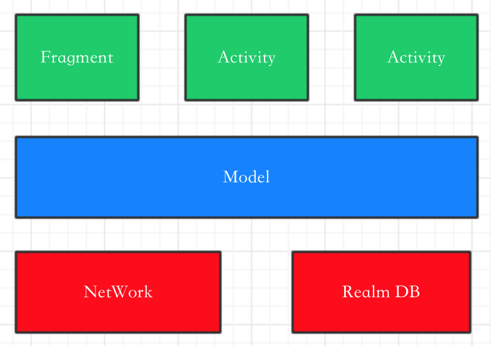

# 包结构

| 包名            | 内容                         | 备注                 |
| ------------- | -------------------------- | ------------------ |
| entity        | 项目实体类                      |                    |
| net           | 网络有关的工具                    |                    |
| util          | 工具类，与业务没有任何关系              |                    |
| activity      | Activity                   | 暂时负担起Controller的作用 |
| view.fragment | Fragment界面                 |                    |
| view.adapter  | 放置RecyclerView之类需要的adapter |                    |
| view.widget   | 自定义控件                      |                    |


# 项目结构

暂时只考虑最原始的MVC结构开发

绿色为UI+Controller，尽可能不接入业务处理，仅控制UI方面的工作

蓝色为Model，主要处理业务内容

红色为底层能力支撑，不会接入业务的处理

 


# 实例设计


# 开发规范

#### 控件绑定：

在xml的layout写好布局后，在Activity中勿用findviewbyid进行对view的绑定，使用[Butter Knift](http://jakewharton.github.io/butterknife/) 的方法来取缔。

example：

```java
//绑定控件
@BindView(R.id.toolbar)
Toolbar toolbar;

//提供点击事件给控件
@BindView(R.id.btn_add_test_data)
FloatingActionButton btn_add_test_data;
```


[Butter Knift的更多说明](http://jakewharton.github.io/butterknife/)


-----

#### Rey5137 Material 

当前控件，优先选择 [rey5137/material](https://github.com/rey5137/material) 的控件

-----

#### Activity

新建的任何Activity都要集成BaseActivity，